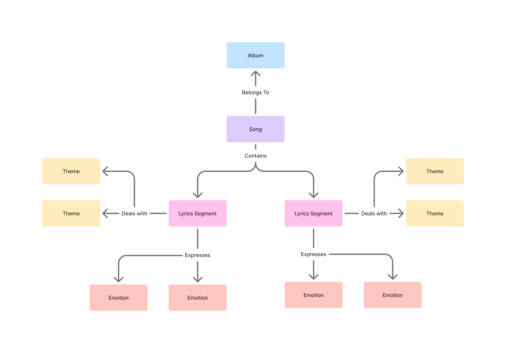
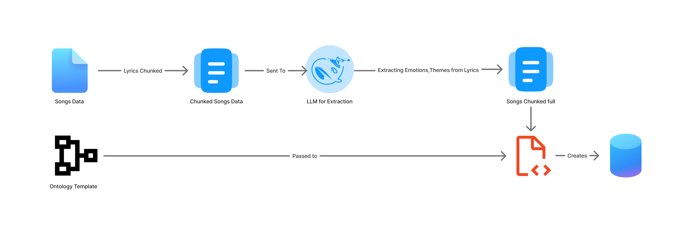
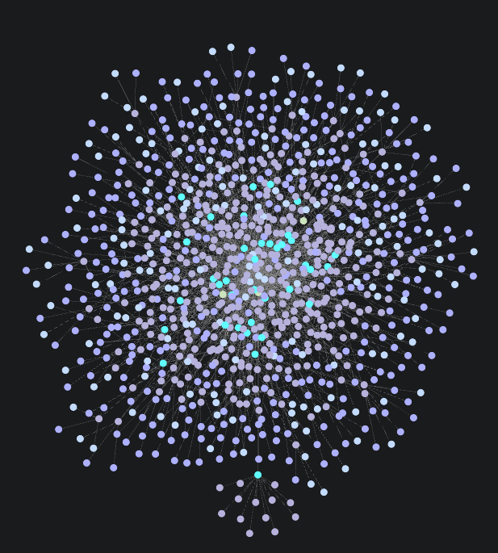
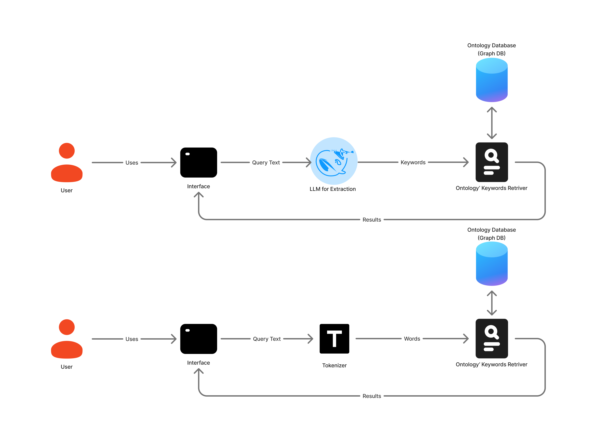

# Taylor Swift Lyrics Search Engine  (𝑻𝒂𝒚𝒍𝒐𝒓’𝒔 𝑽𝒆𝒓𝒔𝒊𝒐𝒏)  🧣🍂

*"I can still make the whole place shimmer"*. This search engine helps you find exactly which shimmering lyrics you're looking for!
A semantic and ontology-based search engine for Taylor Swift lyrics with three distinct search approaches.

## Features

- **Three Search Modes**:
  - **Ontology (Keyword Search)**: Direct keyword matching in the knowledge graph
  - **Ontology LLM**: LLM-extracted keywords for graph search
  - **Semantic**: Vector similarity search using embeddings

- **Knowledge Graph** with 5 entity types:
  - Songs
  - Albums
  - Lyrics Segments (4-line chunks)
  - Themes
  - Emotions

## Ontology' Architecture

 

## Data Pipeline

1. **Data Preparation**:
   - `scripts/extract_emotions_data.py`: 
     - Chunks lyrics into 4-line segments
     - Uses LLM (Deepseek r1 1.5b) to extract emotions/themes for each segment
     - Outputs enriched CSV with emotions/themes

2. **Graph Construction**:
   - `scripts/fill_ontology.py`:
     - Creates Neo4j graph with Song/Album/Segment/Theme/Emotion nodes
     - Establishes relationships between entities
     - A total of `6k nodes` were generated, connected with `15k relations`.

3. **Embedding Generation**:
   - `scripts/add_embeddings.py`:
     - Adds `all-mpnet-base-v2` embeddings to all lyric segments


**Database Visualization** :




## Search Implementation

- **Main Components** (`main.py`):
  - `SwiftEngineSemantic` class handles all search logic
  - 4 main methods:
    1. `simpleTokenizer()`: Basic keyword extraction
    2. `llmKeywordExtractor()`: LLM-enhanced keyword extraction
    3. `semanticSearch()`: Full vector similarity search
    4. `search()`: Groups `simpleTokenizer/llmKeywordExtractor` with graph searcher to create full pipeline.

- **Web Interface** (`app.py`):
  - Streamlit-based UI with three search options
  - Displays results with song/album context

## How to Use

1. **Setup**:
   ```bash
   pip install -r requirements.txt
   ollama pull deepseek-r1:1.5b
   ```
    *Note : Make sure Ollama is installed*

2. **Run**:
   ```bash
   make run
   ```

### Search Options:
In total, we have 3 modes

**Ontology**: Fast keyword search in graph, using simple tokenization

**Ontology LLM**: Smarter keyword extraction via LLM, followed by a graph search.

**Semantic**: Most sophisticated semantic search, using embeddings and cosine similiarity.


### Performance Notes
- LLM emotion/theme extraction took `~3 hours` for full dataset

- All embeddings generated with `all-mpnet-base-v2`

- Neo4j optimized for complex graph queries

*🔮 This is our place, we make the rules.*